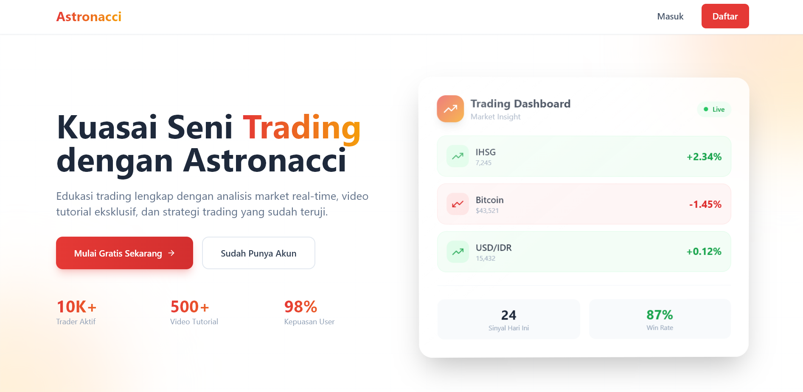

# ASTRONACCI - Trading & Research Platform

Platform web fullstack untuk edukasi trading dan research pasar finansial. Aplikasi ini menyediakan akses ke artikel analisis market dan video tutorial trading berdasarkan level membership pengguna.

## Screenshot



## Fitur

- **Multi-Provider Authentication** - Login dengan email/password, Google, atau GitHub
- **Account Linking** - Link beberapa akun OAuth ke satu akun (dengan konfirmasi user)
- **Membership System** - 3 tipe membership (Free, Basic, Premium) dengan batasan akses konten
- **Smart Access Control** - Konten yang sudah dibaca/ditonton tidak mengurangi kuota lagi
- **Content History** - Lihat riwayat artikel dan video yang sudah diakses
- **Search & Filter** - Cari konten berdasarkan judul atau kategori

## Tech Stack

**Frontend:** React.js 18, Vite, Tailwind CSS, Framer Motion, Context API

**Backend:** Node.js, Express.js, MySQL, Sequelize ORM, Passport.js, JWT (stored in HTTP-only cookies)

## Cara Setup

### Yang Harus Diinstall Dulu

- Node.js (v16+)
- MySQL (v8+)
- Git

Cek udah terinstall belum:

```bash
node --version
npm --version
mysql --version
```

### 1. Clone Project

```bash
git clone <repository-url>
cd Astronacci_fullstack_test
```

### 2. Setup Database

Buka MySQL (terminal atau Workbench), lalu:

```sql
CREATE DATABASE astronacci_trading;
```

### 3. Setup Backend

```bash
cd server
npm install
```

Bikin file `.env` di folder `server`:

```env
# Server
PORT=5000
NODE_ENV=development

# MySQL
DB_HOST=localhost
DB_PORT=3306
DB_NAME=astronacci_trading
DB_USER=root
DB_PASSWORD=

# JWT (ganti dengan random string)
JWT_SECRET=random-secret-key-ganti-ini

# Client URL
CLIENT_URL=http://localhost:5173

# OAuth (optional, isi xxx kalo ga dipake)
GOOGLE_CLIENT_ID=xxx
GOOGLE_CLIENT_SECRET=xxx
GOOGLE_CALLBACK_URL=http://localhost:5000/api/auth/google/callback

FACEBOOK_APP_ID=xxx
FACEBOOK_APP_SECRET=xxx
FACEBOOK_CALLBACK_URL=http://localhost:5000/api/auth/facebook/callback

GITHUB_CLIENT_ID=xxx
GITHUB_CLIENT_SECRET=xxx
GITHUB_CALLBACK_URL=http://localhost:5000/api/auth/github/callback
```

Jalankan migrations & seeders:

```bash
npx sequelize-cli db:migrate
node run-seeders.js
npm run dev
```

Server jalan di `http://localhost:5000`

### 4. Setup Frontend

Buka terminal baru:

```bash
cd client
npm install
```

Bikin file `.env` di folder `client`:

```env
VITE_API_URL=http://localhost:5000/api
```

Jalankan:

```bash
npm run dev
```

Frontend jalan di `http://localhost:5173`

### 5. Mulai Pake Aplikasi

1. Buka browser: `http://localhost:5173`
2. Register akun baru
3. Login
4. Pilih membership
5. Done!

## Troubleshooting

**Database ga konek**

- Cek MySQL udah jalan belum
- Cek username/password di `.env`
- Pastikan database `astronacci_trading` udah dibuat

**Port udah dipake**

- Tutup aplikasi yang pake port 5000 atau 5173
- Atau ganti PORT di config

**Error npm install**

- Hapus `node_modules` sama `package-lock.json`
- `npm install` lagi

**OAuth ga jalan**

- OAuth optional kok, bisa pake email/password aja
- Kalo mau aktifin OAuth, daftar app dulu di provider (Google/GitHub/Facebook)

## Membership Types

- **Free (Tipe A)** - 3 artikel + 3 video gratis
- **Basic (Tipe B)** - 10 artikel + 10 video (Rp 99K/bulan)
- **Premium (Tipe C)** - Unlimited semua konten (Rp 199K/bulan)

## Struktur Project

```
server/
  ├── config/       - Database & passport config
  ├── controllers/  - Business logic
  ├── middleware/   - Auth & access control
  ├── models/       - Database models
  ├── routes/       - API endpoints
  ├── migrations/   - Database schema
  └── seeders/      - Initial data

client/
  ├── src/
  │   ├── components/  - Reusable components
  │   ├── pages/       - Page components
  │   ├── services/    - API services
  │   ├── context/     - Global state (Auth)
  │   ├── hooks/       - Custom React hooks
  │   └── utils/       - Helper functions
  └── public/          - Static files
```

## API Endpoints

Base URL: `http://localhost:5000/api`

### Auth

| Method | Endpoint                  | Deskripsi                   | Auth |
| ------ | ------------------------- | --------------------------- | ---- |
| POST   | `/auth/register`          | Register akun baru          | -    |
| POST   | `/auth/login`             | Login dengan email/password | -    |
| POST   | `/auth/logout`            | Logout                      | ✓    |
| GET    | `/auth/me`                | Get current user info       | ✓    |
| POST   | `/auth/select-membership` | Pilih tipe membership       | ✓    |
| POST   | `/auth/link-account`      | Link akun OAuth             | ✓    |
| GET    | `/auth/google`            | Login dengan Google         | -    |
| GET    | `/auth/github`            | Login dengan GitHub         | -    |
| GET    | `/auth/facebook`          | Login dengan Facebook       | -    |

### Articles

| Method | Endpoint        | Deskripsi          | Auth |
| ------ | --------------- | ------------------ | ---- |
| GET    | `/articles`     | Get semua artikel  | ✓    |
| GET    | `/articles/:id` | Get detail artikel | ✓    |

Query params untuk `/articles`: `search`, `category`

### Videos

| Method | Endpoint      | Deskripsi        | Auth |
| ------ | ------------- | ---------------- | ---- |
| GET    | `/videos`     | Get semua video  | ✓    |
| GET    | `/videos/:id` | Get detail video | ✓    |

Query params untuk `/videos`: `search`, `category`

### Users

| Method | Endpoint                 | Deskripsi                        | Auth |
| ------ | ------------------------ | -------------------------------- | ---- |
| GET    | `/users/profile`         | Get profile user                 | ✓    |
| GET    | `/users/stats`           | Get statistik akses konten       | ✓    |
| GET    | `/users/content-history` | Get riwayat konten yang diakses  | ✓    |
| GET    | `/users/viewed-content`  | Get ID konten yang sudah dilihat | ✓    |
